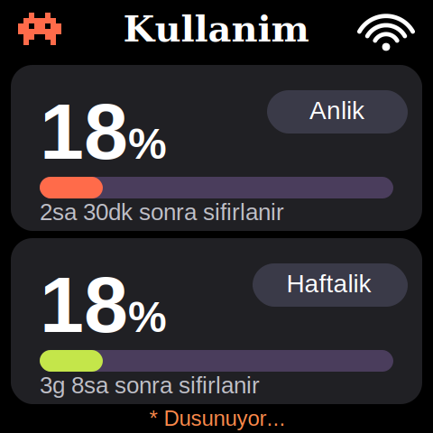

# SmallTV Claude Monitor

Custom, from-scratch firmware that turns a cheap **GeekMagic SmallTV** (ESP8266, 1.54" 240×240 IPS) into a glanceable desk display for your **PC stats** and your **Claude usage limits** — with a web control panel, Turkish font support, and an animated theme.

> Firmware written in C++/Arduino (PlatformIO). A tiny Python agent pushes data to the device over your LAN. Replaces the stock GeekMagic firmware (reversible via OTA).



## Features

- 🖥️ **PC stats screen** — CPU % / RAM % ring gauges (via a `psutil` agent)
- 🤖 **Claude usage screen** — 5‑hour + weekly limit used %, with a live "resets in …" countdown
- 🔁 **Auto‑rotating screens** (configurable interval, or pick one)
- 🎛️ **On‑device web control panel** — deadzone/safe‑area sliders + live preview, screen toggles, brightness, editable texts, theme switch
- 🇹🇷 **Turkish font** embedded (the built‑in ESP fonts have no ı/ş/ğ/ü) — regenerable from any open font
- ✨ **Two themes** — flat "Classic" and an animated "Glow" (pulsing borders + bobbing mascot)
- 📡 **OTA updates** + WiFi captive‑portal fallback — no cable needed after the first flash

## Hardware

| | |
|---|---|
| MCU | ESP8266 / ESP‑12F, 4 MB flash |
| Display | ST7789, 240×240 IPS, hardware SPI |
| Device | GeekMagic **SmallTV Ultra** (ESP8266 variant) |

**Pin map** (ST7789): `SCLK=GPIO14` · `MOSI=GPIO13` · `DC=GPIO0` · `RST=GPIO2` · `BL=GPIO5 (active‑LOW)` · `CS=GND`

## Build & flash

```bash
# 1) WiFi credentials
cp src/secrets.h.example src/secrets.h   # then edit SSID/password

# 2) build (PlatformIO)
pio run                                   # -> .pio/build/smalltv_ultra/firmware.bin

# 3) flash over the air (first time: use the stock GeekMagic /update page)
#    http://<device-ip>/update  -> upload firmware.bin
```
After the first flash the firmware serves its **own** `/update` page, so every later update is wireless.

## Run the agent

```bash
pip install psutil
python agent/agent.py        # edit DEVICE = "http://<device-ip>" at the top
```
The agent pushes CPU/RAM every 2 s and (optionally) Claude usage every 5 min.

## Web panel

Open `http://<device-ip>/` — adjust the safe‑area (fixes bezel clipping) with a live preview, toggle screens, set brightness, edit every on‑screen label, and switch themes. Saved to the device (LittleFS) and applied instantly.

## Turkish font

The ESP built‑in fonts are ASCII‑only. `src/trfont.h` is a Latin‑5 (ISO‑8859‑9) GFX font generated from **DejaVu Sans Bold**. To regenerate from another open font:

```bash
pip install freetype-py
python tools/gen_font.py path/to/YourFont-Bold.ttf   # -> src/trfont.h
```

## ⚠️ About the Claude usage feature — read this

The Claude screen reads your **own** local OAuth token (the same one Claude Code stores in `~/.claude/.credentials.json`) and calls Anthropic's **undocumented** `api/oauth/usage` endpoint — the same call Claude Code's `/usage` makes.

- It is **read‑only** and does **not** consume your tokens/limit, and costs nothing.
- The token never leaves your machine; the device only receives the percentages.
- It is **not an official API** — it may break if Anthropic changes it, and automating internal endpoints is a gray area. **Use at your own risk, on your own account.**
- Don't like it? Set `ENABLE_CLAUDE = False` in `agent/agent.py`; the token is then never touched and the PC screen still works.

## Credits

- Display driver: [TFT_eSPI](https://github.com/Bodmer/TFT_eSPI)
- Font: [DejaVu Sans](https://dejavu-fonts.github.io/) (bundled bitmap is a derivative, permissive license)
- Device & stock firmware: [GeekMagic SmallTV](https://github.com/GeekMagicClock/smalltv-ultra)
- Firmware co‑developed with **Claude Code** 🤖

## License

MIT — see [LICENSE](LICENSE).
